# Module 7 - Bringing It All Together

Locating, Installing and Verifying your Data

- Name: Taylor Martin
- Course: Database for Analytics
- Module: 7

---

## Locating Your Data

The first step of the project and arguably the most difficult step was locating data that met all the following qualifiers:

  - Include at least 3 tables
  - One table must have at least 1000 rows
  - Two other tables must have at least 100 rows
  - Must be at least one date data type
  - Must be at least one numeric data type
  - Must be at least one string data type

I first started looking for hockey data sets following the suggestion to find something I was interested in and struggled to find sets with enough tables or rows. Then I switched and tried looking just for large data sets. I found the MOMA dataset which really interested me and though it surpassed the row requirements it only had 2 tables. The chinook database wasn't my original choice after that I first tried the pagila database and when I tried to install it received the error discussed below.

The chinook dataset is located here: https://github.com/lerocha/chinook-database. It is a sample dataset mocking a digital media store like Apple or Amazon Music.

## Installing Your Data

As mentioned above the chinook database wasn't my original choice. I first chose the pagila database and when I tried to install it received this error: "ERROR: extension "vector" is not available HINT: The extension must first be installed on the system where PostgreSQL is running SQL state: 0A000." After researching the error there were two possibilites either remove or commenting out the commands regarding VECTOR or installing the extension. From what I read the extension installation was not recommended for a school project so I attempted commenting out. I attempted and tried installing several times but kept running into the same error. That was when I elected to try installing chinook instead.
 .....

## Verifying Your Data

The dataset includes 11 tables: album, artist, customer, employee, genre, invoice, invoice_line, media_type, playlist, playlist_track and track.

The album table consists of three columns: album_id as an integer, title as character varying and artist_id as an integer. The table has 347 rows. Album_id is the foreign key connecting to the Track table.

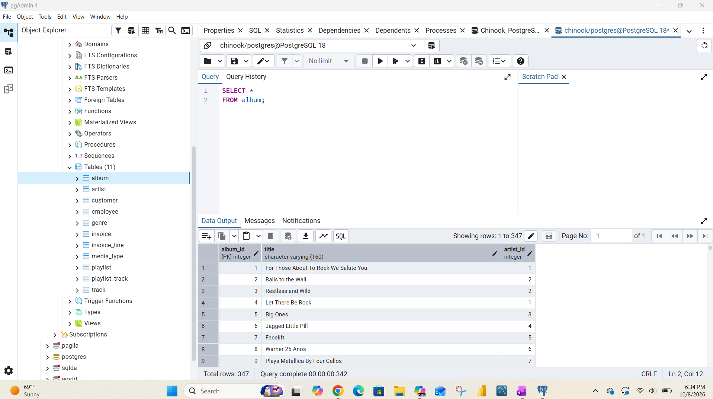

The artist table consists of 2 columns: artist_id as an integer and name as character varying text. The table has 275 rpws. Artist_id is the foreign key connecting to the Album table.

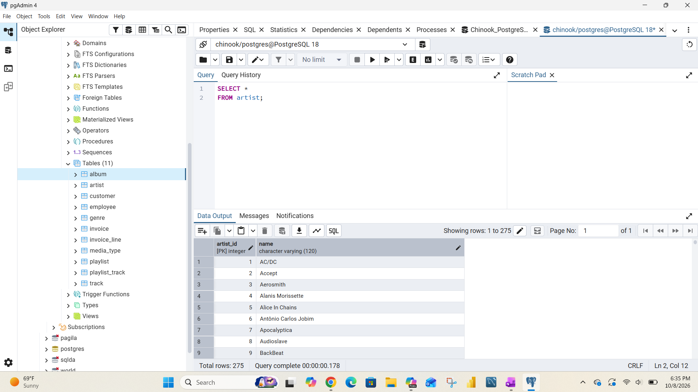

The customer table consists 13 columns: customer_id as an integer, first_name as character varying text, last_name as character varying text, company as character varying text, address as character varying text, city as character varying text, state as character varying text, country as character varying text, postal_code as character varying text, phone as character varying text, fax as character varying text, email as character varying text, and support_rep_id as an integer. The table has 59 rows. Customer_id is a foreign key connecting to the Invoice table.

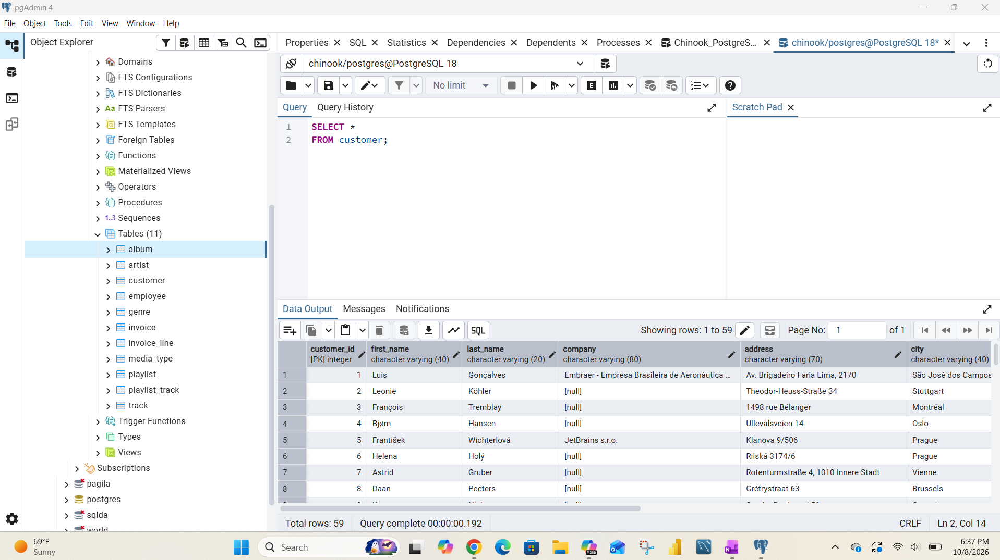

The table consists of 15 columns: employee_id as an integer, last_name as character varying text, first_name as character varying text, title as character varying text, reports_to as an integer, birth_date as a timestamp without time zone, hire_date as a timestamp without time zone, address as character varying text, city as character varying text, state as character varying text, country as character varying text, postal_code as character varying text, phone as character varying text, fax as character varying text, and email as character varying text. The table consists of 8 rows.

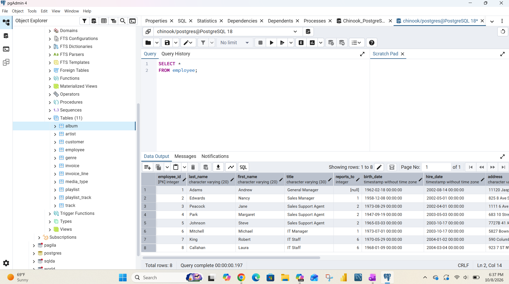

The genre table consists of 2 columns: genre_id as an integer and name and character varying text. The table consists of 25 rows. Genre_id is a foreign key that connects to the Track table.

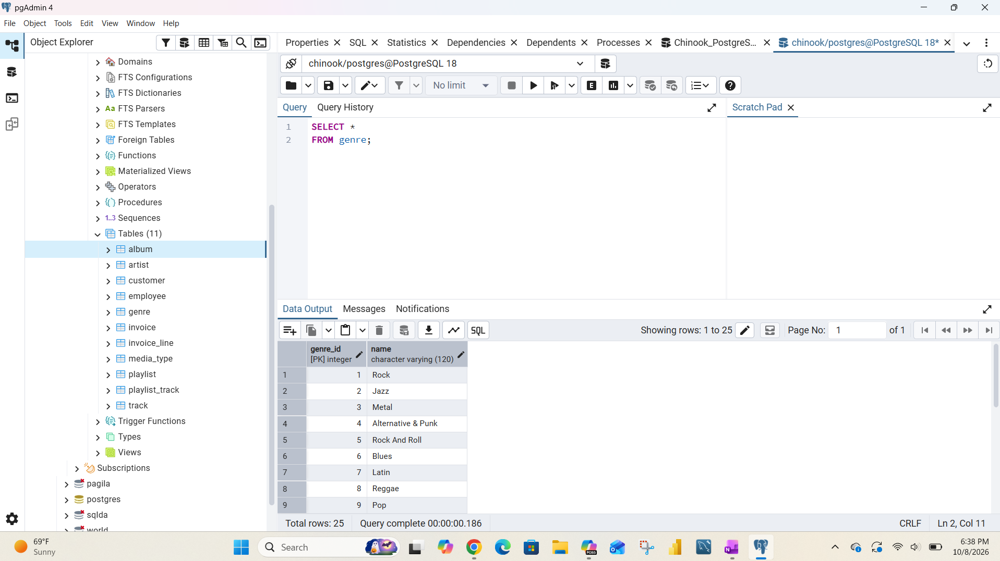

The invoice table consists of 9 columns: invoice_id as an integer, customer_id as an integer, invoice_date as a timestamp without a time zone, billing_address as character varying text, billing_city as character varying text, billing_postal_code as character varying text and total as a numeric (10,2). The table contains 412 rows. Invoice_id is the foreign key connecting to the Invoice_Line table.

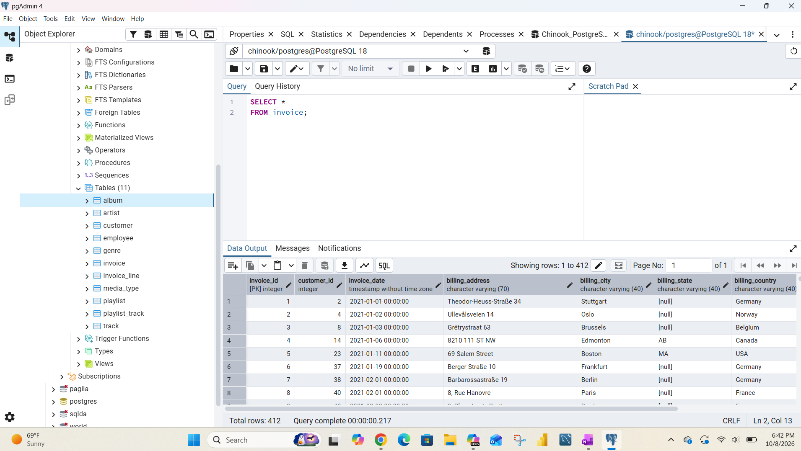

The invoice_line table consists of 5 columns: invoice_line_id as an integer, invoice_id as an integer, track_id as an integer, unit_price as a numeric and quantity as an interger. The table consists of 2240 rows.

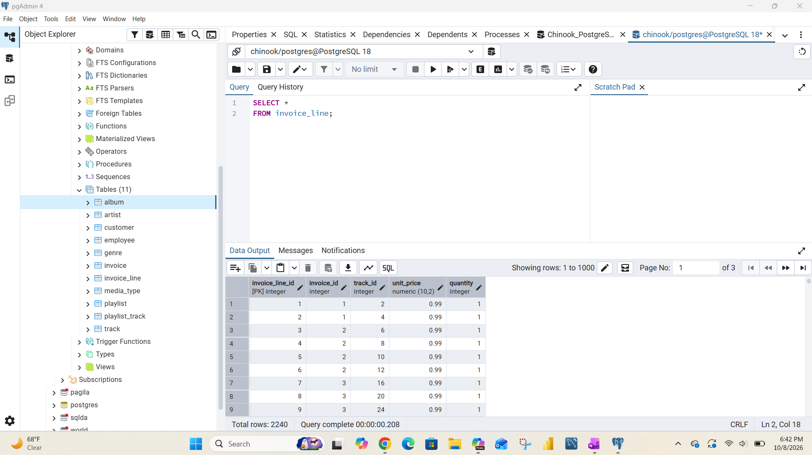

The media_type table consists of 2 columns: media_type_id as an integer and name as character varying text. The table consists of 5 rows. Media_type is the foreign key connecting to the Track table.


The playlist table consists of 2 columns: playlist_id as an integer and name as character varying text. The table consists of 18 rows. Playlist_id is the foreign key that connects to the Playlist Track Table.


The playlist_track table consists of 2 columns: playlist_id as an integer and track_id as an integer. The table consists of 8715 rows. Both columns are primary keys connecting to other tables. Playlist_id connects to the playlist table and track_id connects to the track table.


The track table consists of 9 columns: track_id as an integer, name as character varying text, album_id as an integer, media_type_id as an integer, genre_id as an integer, composer as character varying text, milliseconds as an integer, bytes as an integer and unit_price as a numeric. THe table consists of 3503 rows. Track_id is a foreign key connecting to the Playlist Track table; while Album_id, Media_type and genre_id are primary keys connecting to the album, Media Type and Genre tables respectively.


### Table Structure
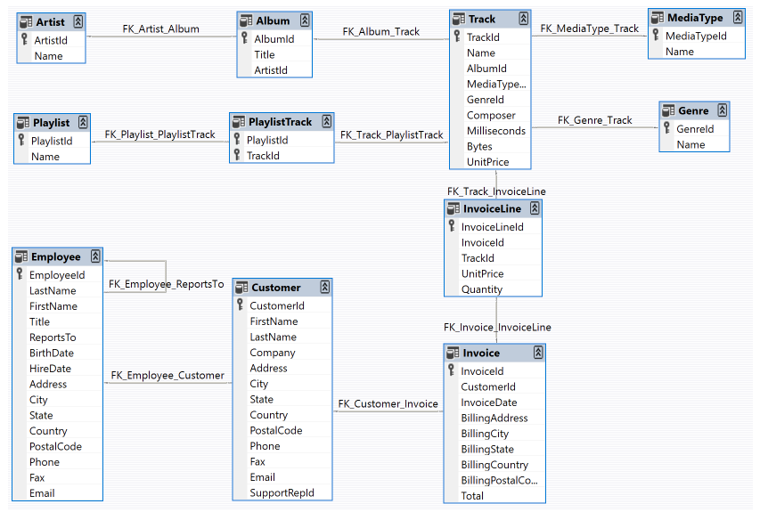
Table Structure used from https://github.com/lerocha/chinook-database

### Challenges
Some of the biggest challenges were understanding the foreign keys and how the tables tie together expecially with the contents and sizes of the tables differing so greatly. Some of the tables only really contain ids and nothing valuable so using the JOINs are needed and valuable to produce meaningful results.

The other issues were missing or duplicate information. Some tables were missing quite of bit of information while others required combining several tables for any useful analysis.

### Queries

```sql
SELECT
    customer.customer_id,
    customer.first_name,
    customer.last_name,
    invoice.invoice_id,
    invoice.total
FROM customer
JOIN invoice
    ON customer.customer_id = invoice.customer_id
ORDER BY invoice.total DESC;
```
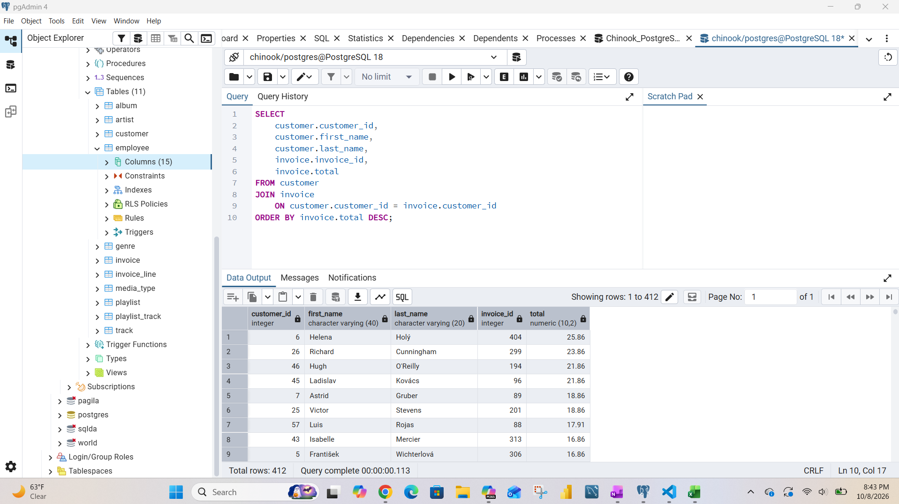

Query's purpose is to combine customer and invoice data to better analyze purchases.

```sql
SELECT
    customer.customer_id,
    customer.first_name,
    customer.last_name,
    SUM(invoice.total) AS total_spent
FROM customer
JOIN invoice
    ON customer.customer_id = invoice.customer_id
GROUP BY
    customer.customer_id,
    customer.first_name,
    customer.last_name
ORDER BY total_spent DESC;
```

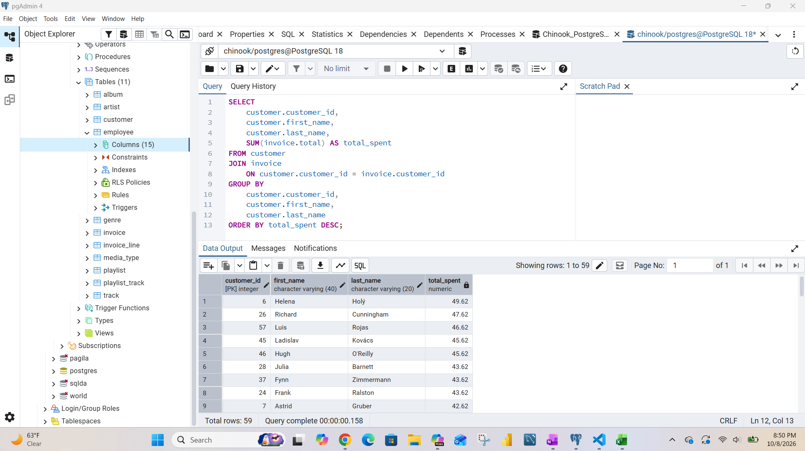

Query's purpose is to identiry the customers that spend the most.

```sql
SELECT
    artist.name,
    COUNT(*) AS songs_sold
FROM invoice_line
JOIN track
    ON invoice_line.track_id = track.track_id
JOIN album
    ON track.album_id = album.album_id
JOIN artist
    ON album.artist_id = artist.artist_id
GROUP BY artist.name
ORDER BY songs_sold DESC;
```

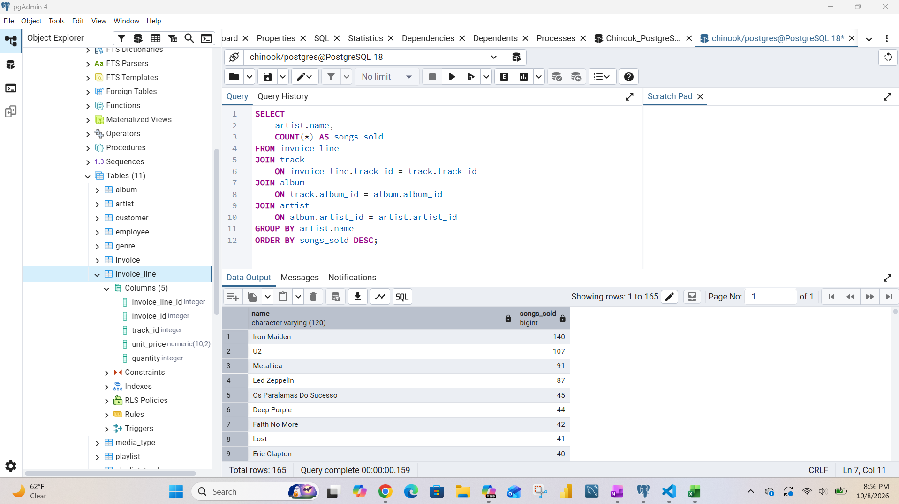

Query's purpose to show the artists that generate the most sales.

## Next Steps

Following the idea of the music store/library information I would like to expand this project and try using my own music library to generate the SQL scripts.
