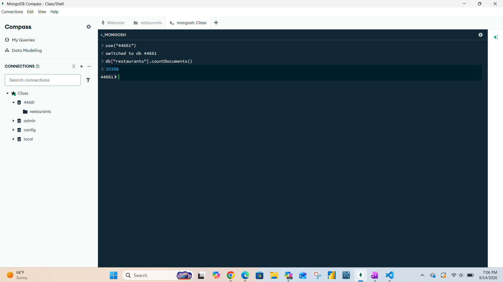
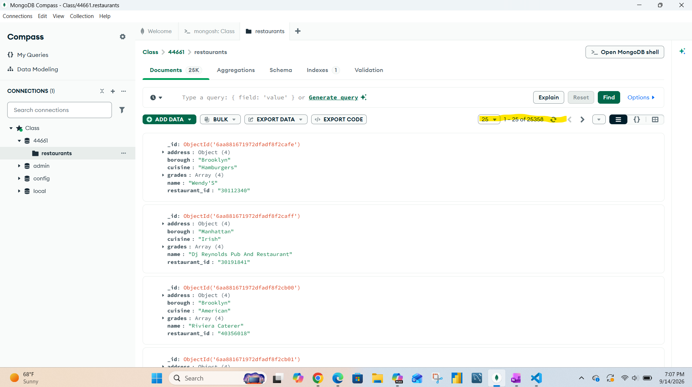
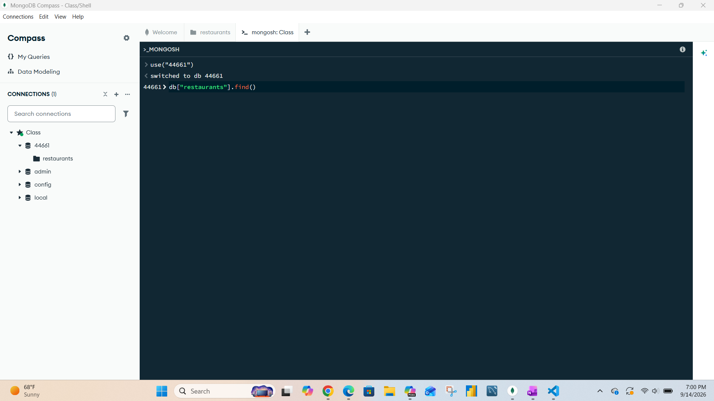
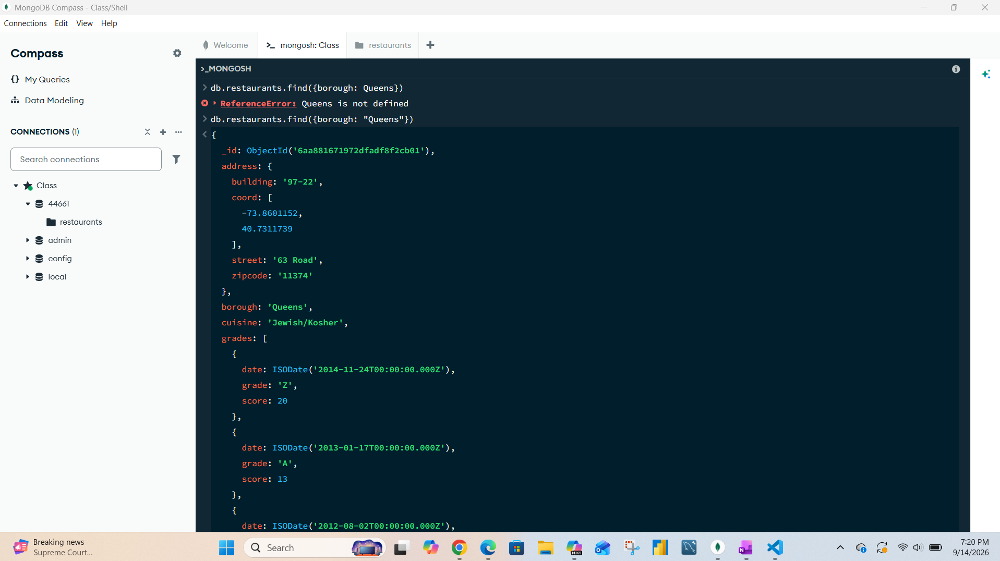
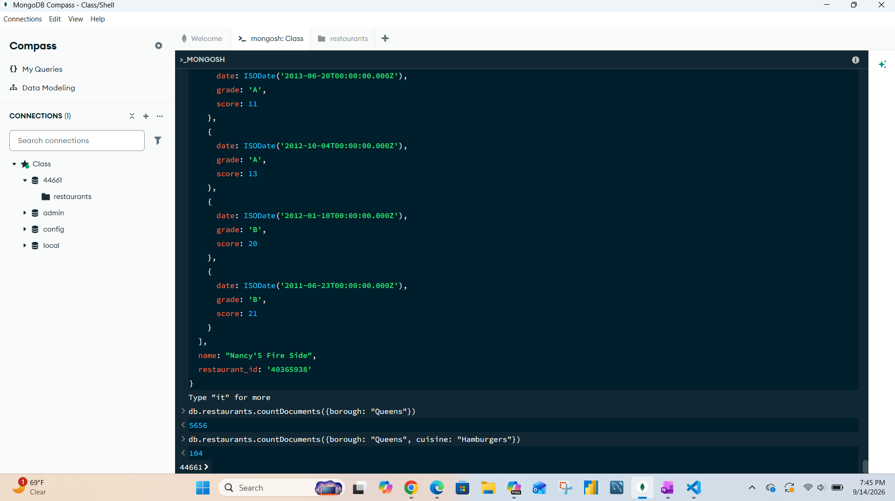
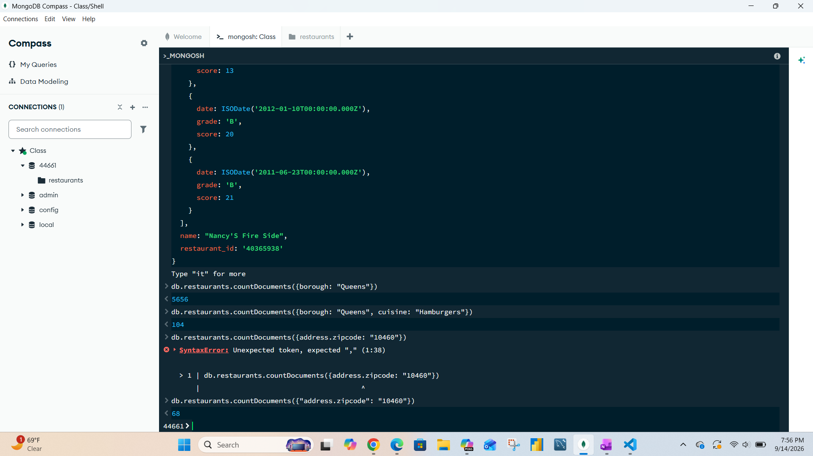
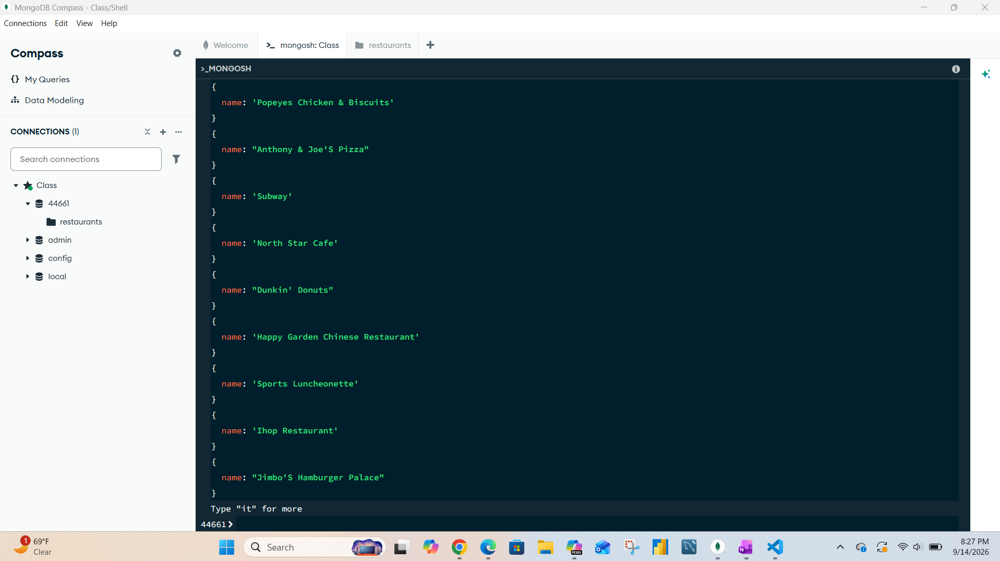
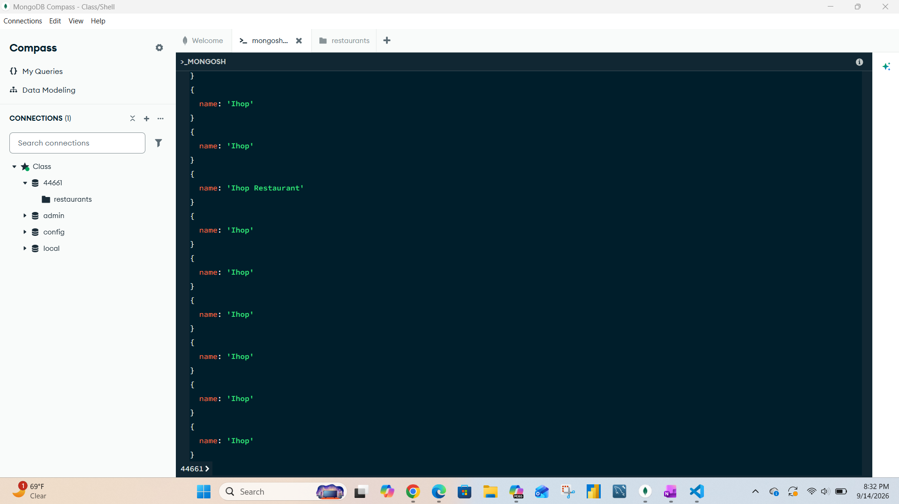

# Exercise 03: MongoDB – Document Queries and Analysis

- Name: TaylorM Marti
- Course: Database for Analytics
- Module: 3
- Database Used: MongoDB
- Dataset: `restaurants-json.json`

---

## Instructions

- Import the provided `restaurants-json.json` file into MongoDB.
- All commands must be **executed by you** in the MongoDB shell or MongoDB Compass.
- For each query:
  - Include the MongoDB command in a fenced code block
  - Include a **screenshot** showing the command and its result
- Store screenshots in the `screenshots/` folder and embed them below each answer.

---

## Question 1

When importing the documents from `restaurants-json.json`,
**how many documents were imported into your collection**?

### Answer

25358 documets were imported from restaurants-json.json. Confirmed using a count query but Mongo also provided a total document count with the page navigation.

### Screenshot

_Show evidence of how you determined this (for example, a count query)._

```javascript
db.restaurants.countDocuments()
```




---

## Question 2

Before writing queries on the data,
**what command** do you use to set the
**MongoDB shell to operate on the `44661` database**?

### MongoDB Command

```javascript
use 44661
```

### Screenshot



---

## Question 3

Using your `restaurants` collection in the `44661` database,
write the MongoDB query needed to
**locate all documents in the `"Queens"` borough**.

### MongoDB Query

```javascript
db.restaurants.find({borough: "Queens"})
```

### Screenshot



---

## Question 4

Using your `restaurants` collection in the `44661` database,
write the MongoDB query needed to
**find the number of restaurants in the `"Queens"` borough**.

### Answer

There are 5656 restaurants that are in the Queens borough.

### MongoDB Query

```javascript
db.restaurants.countDocuments({borough: "Queens"})
```

### Screenshot


---

## Question 5

Using your `restaurants` collection in the `44661` database,
write the MongoDB query needed to
**find the number of restaurants** in the `"Queens"` borough
**whose cuisine is `"Hamburgers"`**.

### Answer

There are 104 restaurants that are in the Queens borough that's cusine is hamburgers.

### MongoDB Query

```javascript
db.restaurants.countDocuments({borough: "Queens", cuisine: "Hamburgers"})
```

### Screenshot



---

## Question 6

Using your `restaurants` collection in the `44661` database,
write the MongoDB query needed to
**find the number of restaurants in Zipcode `10460`**.

_Hint: Look up how to query **embedded documents**._

### Answer

There are 68 restaurants that are in the zipcode 10460.

### MongoDB Query

```javascript
db.restaurants.countDocuments({"address.zipcode": "10460"})
```

### Screenshot



---

## Question 7

Using your `restaurants` collection in the `44661` database,
write the MongoDB query needed to
**display only the names of restaurants in Zipcode `10460`**.

_Hint: Look up how to **project fields** in MongoDB._

Your output should resemble:

```json
{ name: "Wild Asia" }
{ name: "Terrace Cafe" }
{ name: "African Terrace" }
{ name: "Cool Zone" }
{ name: "Beaver Pond" }
...
```

### MongoDB Query

```javascript
db.restaurants.find({"address.zipcode": "10460"},{_id: 0, name: 1})
```

### Screenshot



---

## Question 8

Using your `restaurants` collection in the `44661` database,
write the MongoDB query needed to
**display only the names of restaurants whose name contains `"IHOP"`**,
ignoring case.

Your results should include:

- `"Ihop"`
- `"Ihop Restaurant"`

### MongoDB Query

```javascript
db.restaurants.find({name: {$regex: "IHOP", $options: "i"}}, {_id: 0, name: 1})
```

### Screenshot


