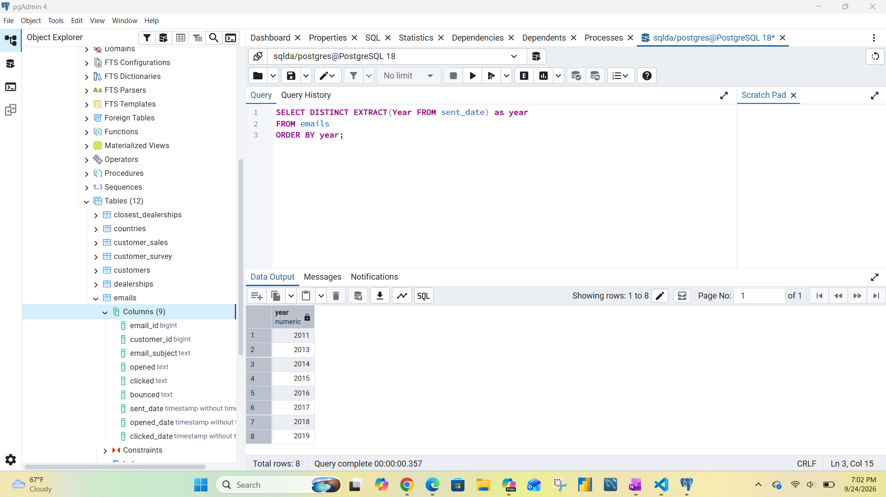
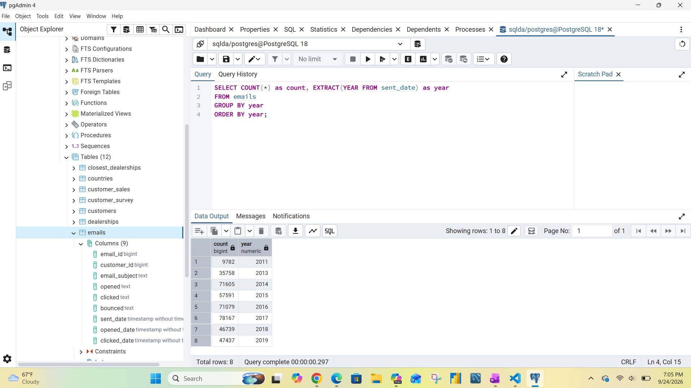
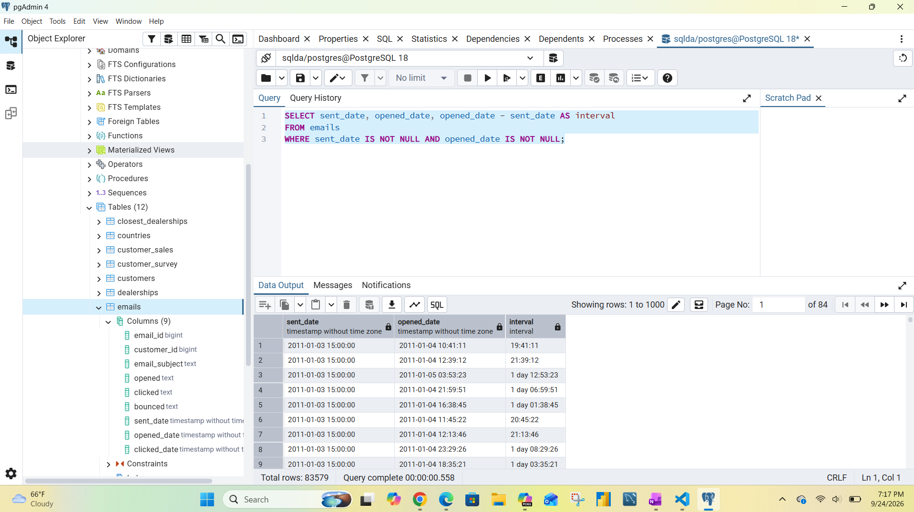
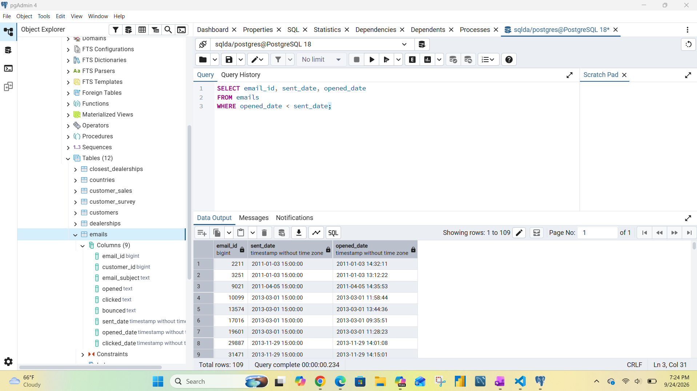
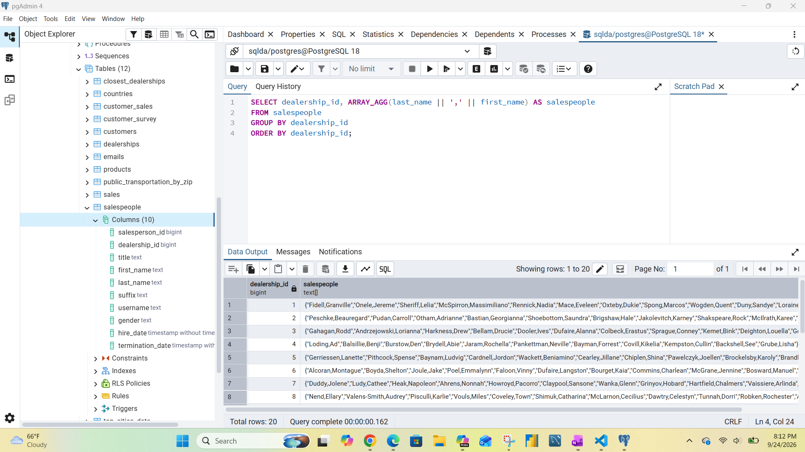
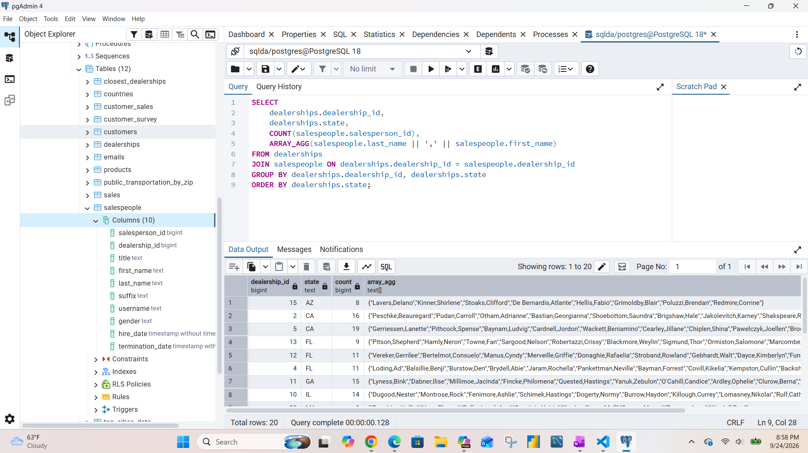
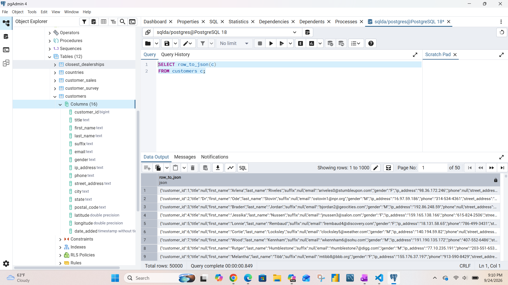
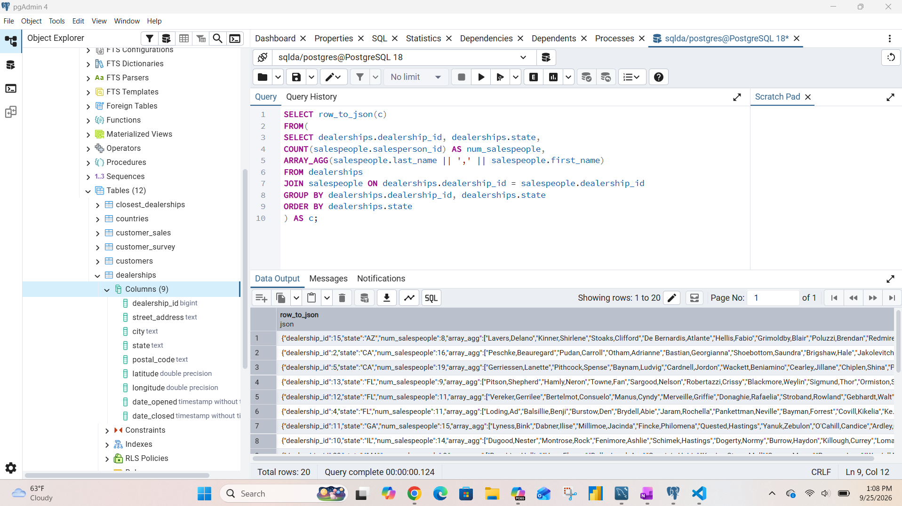

# Exercise 05: SQLDA Database - Dates, Data Quality, Arrays, and JSON

- Name: Taylor Martin
- Course: Database for Analytics
- Module: 5 - Using Complex Data Types
- Database Used: `sqlda` (Sample Datasets)
- Tools Used: PostgreSQL (pgAdmin or psql)

---

## Instructions

- Use the **sqlda** database from the "Loading the Sample Datasets" instructions.
- For each SQL task:
  - Include your SQL in a fenced code block
  - Execute it and include a **screenshot** showing the query and results
- Store screenshots in the `screenshots/` folder and embed them below each answer.
- For explanation questions:
  - Write your answer in complete sentences
  - Include a screenshot if requested

---

## Question 1

Using the `sqlda` database, write the SQL needed
to show a **list of years** that emails were sent.

Your results should list years like this (order matters):

```text
year
2011
2013
2014
2015
2016
2017
2018
2019
```

### SQL

```sql
SELECT DISTINCT EXTRACT(Year FROM sent_date) as year
FROM emails
ORDER BY year;
```

### Screenshot



---

## Question 2

Using the `sqlda` database, write the SQL needed to
show the **number of messages sent by year**,
ordered by year (as shown in the prompt).

Output should resemble:

```text
count   year
...
```

### SQL

```sql
SELECT COUNT(*) as count, EXTRACT(YEAR FROM sent_date) as year
FROM emails
GROUP BY year
ORDER BY year;
```

### Screenshot



---

## Question 3

Using the `sqlda` database, write the SQL needed to show:

- the **sent date**
- the **opened date**
- the **interval** between the two

Only include emails that contain **both** a sent date and an opened date.

### SQL

```sql
SELECT sent_date, opened_date, opened_date - sent_date AS interval
FROM emails
WHERE sent_date IS NOT NULL AND opened_date IS NOT NULL;
```

### Screenshot



---

## Question 4

Using the `sqlda` database,
write the SQL needed to
show emails that contain an **opened date BEFORE the sent date**.

### SQL

```sql
SELECT email_id, sent_date, opened_date
FROM emails
WHERE opened_date < sent_date;
```

### Screenshot



---

## Question 5

Using the `sqlda` database:
there are **over 100 emails**
that contain an opened date **BEFORE** the sent date.

After looking at the data, **why is this the case?**

### Answer

The sent_date and opened_date  are timestamps without time zones so the emails could be being sent in one timezone and being opened in another time zone that is hours behind the time zone they were sent from.

### Screenshot (if requested by instructor)


---

## Question 6

Using the `sqlda` database, explain in your own words what the following code does:

```sql
CREATE TEMP TABLE customer_points AS (
    SELECT
        customer_id,
        point(longitude, latitude) AS lng_lat_point
    FROM customers
    WHERE longitude IS NOT NULL
    AND latitude IS NOT NULL
);

CREATE TEMP TABLE dealership_points AS (
    SELECT
        dealership_id,
        point(longitude, latitude) AS lng_lat_point
    FROM dealerships
);

CREATE TEMP TABLE customer_dealership_distance AS (
    SELECT
       customer_id,
       dealership_id,
       c.lng_lat_point <@> d.lng_lat_point AS distance
    FROM customer_points c
    CROSS JOIN dealership_points d
);
```

### Answer

The sql is creating 3 tempoary tables customer_points, dealership_points and customer_dealership_distance. The customer_points table combines customers longitutde and latitude into a "point" as long as both are not missing data. The dealership_points table is turning the dealerships location into a "point." The dealership_points table does not specify excluding any dealerships with missing location data. The customer_dealership_distance table joins the points created in the first 2 tables and calculates the distance between them.

---

## Question 7

Using the `sqlda` database,
write SQL to display an
**array of salespeople for each dealership**,
sorted by dealership.

For example - dealership 1 is below:

```text
"{""Fidell,Granville"",""Onele,Jereme"",""Sheriff,Lelia"",""McSpirron,Massimiliano"",""Rennick,Nadia"",""Mace,Eveleen"",""Oxteby,Dukie"",""Spong,Marcos"",""Wogden,Quent"",""Duny,Sandye"",""Loraine,Englebert"",""Meere,Ira"",""Gibbens,Cristine"",""Prine,Lyda"",""McCoughan,Sheff"",""Schule,Giselbert"",""McAndie,Eleen"",""Dosedale,Dorie"",""Nafziger,Shay""}"
```

### SQL

```sql
SELECT dealership_id, ARRAY_AGG(last_name || ',' || first_name) AS salespeople
FROM salespeople
GROUP BY dealership_id
ORDER BY dealership_id;
```

### Screenshot



---

## Question 8

Using the `sqlda` database, write SQL to display:

- an **array of salespeople for each dealership**
- the **state** of the dealership
- the **number of salespeople** for the dealership

Sort by **state**.

Reference image:


### SQL

```sql
SELECT
	dealerships.dealership_id,
	dealerships.state,
	COUNT(salespeople.salesperson_id),
	ARRAY_AGG(salespeople.last_name || ',' || salespeople.first_name)
FROM dealerships
JOIN salespeople ON dealerships.dealership_id = salespeople.dealership_id
GROUP BY dealerships.dealership_id, dealerships.state
ORDER BY dealerships.state;
```

### Screenshot



---

## Question 9

Using the `sqlda` database, write the SQL needed to convert
the **customers** table to **JSON**.

### SQL

```sql
SELECT row_to_json(c)
FROM customers c;
```

### Screenshot



---

## Question 10

Using the `sqlda` database, write SQL to display:

- an **array of salespeople for each dealership**
- the **state**
- the **number of salespeople**
- sorted by **state**

Then **convert this result to JSON**.

Reference image:


### SQL

```sql
SELECT row_to_json(c)
FROM(
SELECT
  dealerships.dealership_id,
  dealerships.state,
  COUNT(salespeople.salesperson_id) AS num_salespeople,
  ARRAY_AGG(salespeople.last_name || ',' || salespeople.first_name)
FROM dealerships
JOIN salespeople ON dealerships.dealership_id = salespeople.dealership_id
GROUP BY dealerships.dealership_id, dealerships.state
ORDER BY dealerships.state
) AS c;
```

### Screenshot


